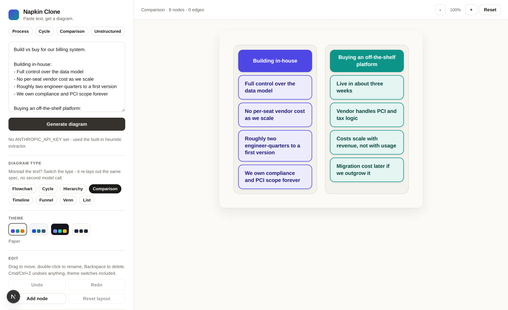
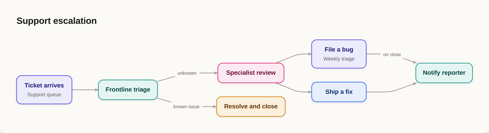
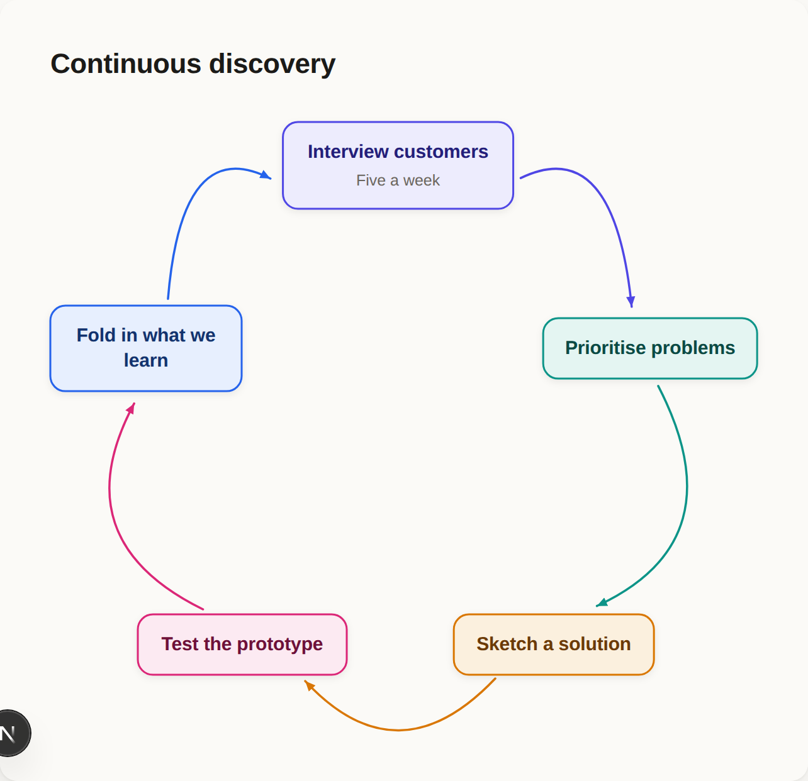
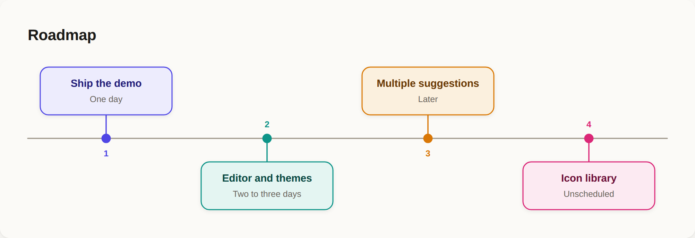
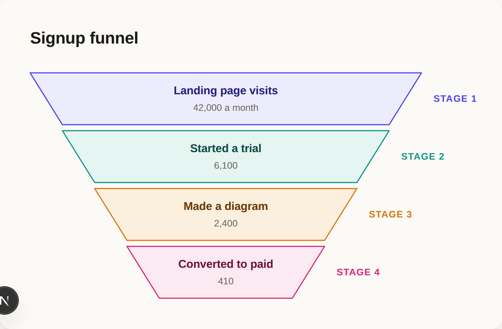
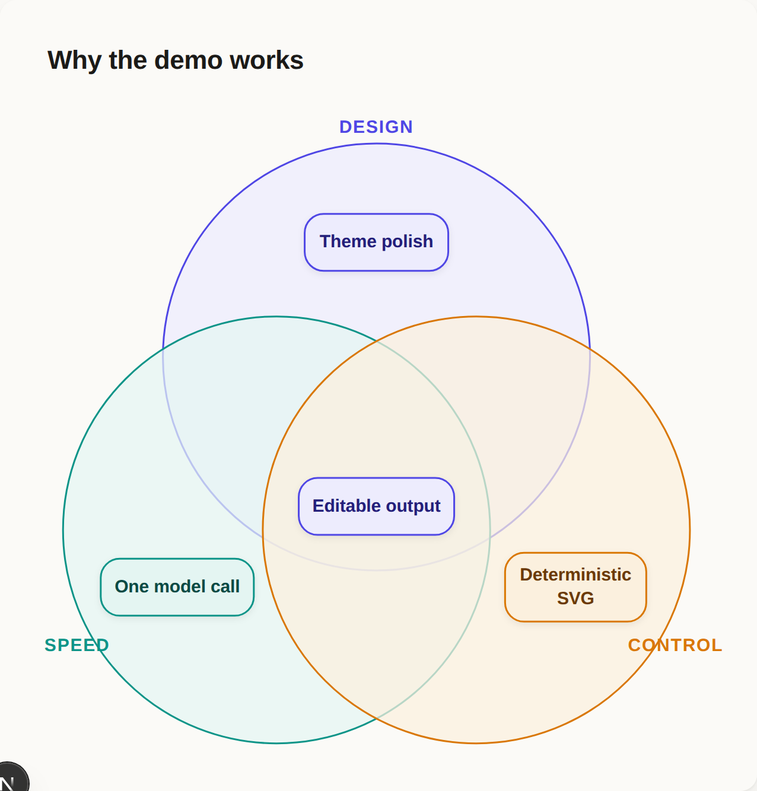

# Napkin Clone — Text → Diagram

Paste text, get a clean editable visual. One LLM call, deterministic rendering.

[](https://github.com/ndunl075/towel-ai/actions/workflows/ci.yml)
[](LICENSE)



```
text ──▶ LLM (structure extraction) ──▶ JSON spec ──▶ layout engine ──▶ SVG ──▶ canvas
```

**The LLM never draws.** It classifies the text and extracts its parts into a
strict JSON spec; everything visible after that is deterministic TypeScript.
That is the whole design decision — model-generated SVG is unreliable and
impossible to restyle, so the model is kept to the one job it is good at. See
[`docs/architecture.md`](docs/architecture.md).

## Layouts

Eight diagram types, each with a hand-written layout function. The model picks
one; you can override it without spending a second call.

| | |
|---|---|
|  |  |
|  |  |



Plus `hierarchy`, `comparison` and `list`. Four themes, applied at render time
so the same spec draws four ways.

## Run it

```bash
npm install
cp .env.example .env.local   # optional - see below
npm run dev
```

Then open <http://localhost:3000>. Five sample texts are one click away.

`ANTHROPIC_API_KEY` is **optional**. Without it the app falls back to a local
heuristic extractor (arrows, numbered steps, `A vs B` sections) so the pipeline
still runs end to end offline. With a key set, extraction goes through
`claude-opus-5` with a schema-constrained response.

| Variable | Default | Purpose |
|---|---|---|
| `ANTHROPIC_API_KEY` | unset | Enables model-based extraction |
| `NAPKIN_MODEL` | `claude-opus-5` | Model used for extraction |
| `NAPKIN_EFFORT` | `medium` | `output_config.effort` for the extraction call |
| `NAPKIN_RATE_LIMIT` | `20` | Extraction requests allowed per window, per client. `0` disables |
| `NAPKIN_RATE_WINDOW` | `60` | Rate-limit window, in seconds |

### Deploying this where other people can reach it

`/api/extract` is the one route that spends money, so it is rate limited per
client address — 20 requests a minute by default. Run locally it never fires.

Read the limiter as a seatbelt, not a lock. State is per process, so serverless
instances each keep their own counters and a cold start forgets everything, and
the client address comes from a proxy header that only the hop directly in
front of you can be trusted to set. **If you deploy this publicly with a key
set, you are paying for whoever finds it.** Put it behind auth, or your own
quota, or don't set a key on the public instance and let visitors use the
heuristic extractor.

## Where things live

| Stage | Files |
|---|---|
| 0. Sectioning | `lib/sections.ts` — splits the paste into independently diagrammable parts |
| 1. Structure extraction | `lib/extract.ts` (model), `lib/heuristic.ts` (fallback), `app/api/extract/route.ts` |
| The spec | `lib/spec.ts` — zod schema, normalisation, repair |
| 2. Layout | `lib/layout/` — `graph.ts` (dagre), `cycle.ts`, `comparison.ts`, `timeline.ts`, `funnel.ts`, `venn.ts`, `list.ts` |
| 3. Render | `components/DiagramSvg.tsx`, `lib/theme.ts` |
| Suggestions | `lib/suggestions.ts` — ranks every type, `components/SuggestionGrid.tsx` draws them |
| 4. Editor | `lib/document.ts` (doc + history), `lib/layout/overrides.ts`, `components/Canvas.tsx` |
| Export | `lib/export.ts` — SVG, PNG, clipboard |
| Abuse control | `lib/ratelimit.ts` — per-client cap on the one route that spends money |

`/fixtures` renders every layout from static specs in `lib/fixtures.ts`. Because
rendering is deterministic, that page is the fastest way to see a layout
regression, and it never spends a model call.

## Status

**v0 and v1 are shipped.**

All eight spec types have a real layout: `flowchart`, `hierarchy`, `cycle`,
`comparison`, `timeline`, `funnel`, `venn`, `list`. Four themes, applied at
render time. The canvas is editable, and export covers PNG, SVG and clipboard.

**Editing.** Drag a node to move it, double-click to rename it, Backspace to
delete it, plus Add node and Reset layout. Cmd/Ctrl+Z undoes anything, theme
switches and type switches included, because the whole editor state is one
`DiagramDoc` and history is a stack of those.

Drag positions are stored as *offsets* from wherever the layout engine put the
node, not as absolute points. Rename a node so its box resizes, and the nudge
still reads as the same nudge. Edges touching a moved node re-route as straight
border-to-border lines — keeping the original dagre spline would leave the
arrow pointing at where the node used to be.

**Suggestions.** The type picker draws its alternatives instead of naming
them: every tile is the real renderer on the real spec, ranked, with the reason
it scored where it did. Picking one is free — it only changes which layout
function runs over the spec already in hand — so a misclassification, the main
quality failure mode, is fixed by looking rather than by guessing from a list of
type names. Tiles the spec cannot make are dimmed and preview the layout it
would degrade to, which is what you would actually get.

Ranking reads what each layout actually consumes. `flowchart` and `hierarchy`
are edge-driven and say nothing without edges. `cycle`, `timeline` and `funnel`
are *order*-driven — they build geometry from the order nodes arrive in, which
is why the cycle fixture carries no edges at all and is still a perfectly good
ring. `comparison` and `venn` are group-driven, and a node left ungrouped while
groups exist is the venn overlap, which is exactly what a comparison has no
column for. Details that parse as numbers which never rise are a funnel and
nothing else.

When the type was wrong because the *text* was misread rather than mislaid out,
**Re-extract as ‹type›** spends one call to read the text again for that shape.

**Sections.** A heading (`#` or setext) starts a new section, and each section
is its own diagram with its own undo history. Regenerate one and the other
diagrams are untouched — which is the point, since a long document usually has
exactly one part the model read badly.

Only a heading splits; a blank line never does. Prose routinely writes a lead-in
line, a blank, then the body it introduces — the "Build vs buy" sample does
exactly that — so splitting on blanks would cut a single comparison into pieces
that each mean nothing alone. A document with no headings stays one section, and
the app behaves exactly as it did before sections existed.

Section ids are a hash of the section's own text, so editing section three
changes only section three's id. Sections one and two keep the diagrams already
generated for them, and undoing the edit brings section three's back from cache.

**Venn convention.** The spec gives a node one group, so overlap membership
needs a rule: a node carrying a `group` sits in that set's exclusive lobe, and
a node with `group: null` is shared by every set and sits in the middle. The
extraction prompt states the same rule.

That closes v1, and v2's multiple-suggestions item. Not built yet: the icon
library (v2).

## How extraction fails safely

1. Model returns something that does not match the schema → one retry with the
   error fed back.
2. Still bad, or the request errors, or the model refuses → the heuristic
   extractor runs.
3. Heuristic finds no structure → a styled list.

`normalizeSpec` also repairs specs that are schema-valid but incoherent: edges
pointing at nodes that were never declared, duplicate ids, self-loops, nodes
referencing an undeclared group. A layout function that throws is caught and
falls back to the list layout rather than taking the page down.

## Scripts

```bash
npm run dev        # dev server
npm run build      # production build
npm run typecheck  # tsc --noEmit
```

## Contributing

See [CONTRIBUTING.md](CONTRIBUTING.md). The short version: the model never
draws, layout code stays pure and deterministic, and `/fixtures` is the
regression check.

No API key is needed to develop against this — CI builds without one, on the
same heuristic-extractor path a contributor without a key will hit.

## License

MIT. See [LICENSE](LICENSE).
